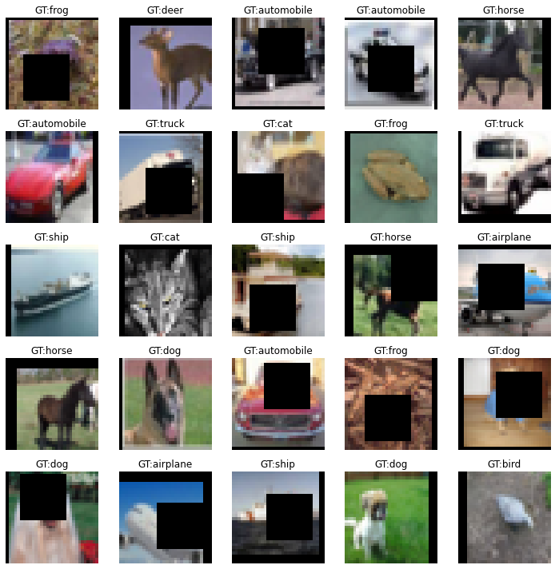
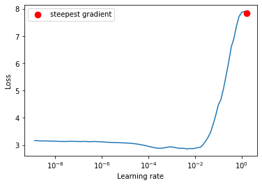
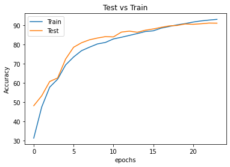
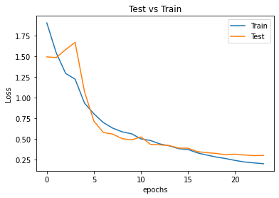
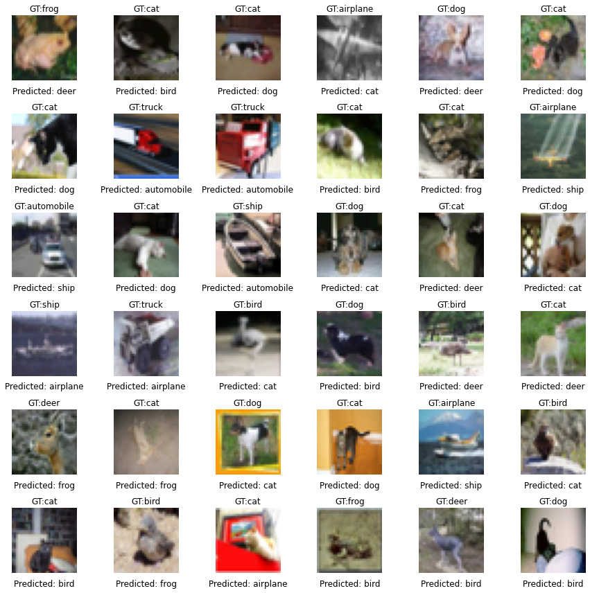

# Impact of 1cycle policy on training time

This repo showcases the use and impact of 1cycle Policy on the training of a deep learning model. 

Manually tuning hyper parameters is an expensive and time-consuming task. The right set of hyper-parameters can reduce the training time and converge faster. The paper - "A Disciplined Approach to Neural Network Hyper-parameters: Part 1 - Learning rate, batch size, momemtum and weight decay" discusses various techniques to efficiently tune hyper parameters. In this notebook, we focus on the technique for setting the learning rate(LR) - 1cycle Policy. 

## What is 1cycle policy?
In the paper "Cyclical Learning Rates for Training Neural Networks", the author introduced the concept of cyclical learning rates as an alternative to the grid search method (with fixed step size and direction) that is computationally expensive. The idea is to allow the learning rate to take values cyclically between pre-determined minimum and maximum bounds. The bounds are identified using the LR range test. 
It is observed that instead of decreasing the LR every couple of epochs, periodically increasing it helps in getting out of saddle point plateaus. The number of iterations to complete half a cycle is the step size. 
In 1cycle policy, the author suggests to use one cycle that has a length slightly lower than total number of iterations/epochs. The maximum bound is found from the range test and the lower bound is much lesser. The cycle has two steps - one from lower to higher and the second is vice versa. In the last phase of training, the LR is decreased to a magnitude that is several orders less than the minimum bound.
The high LR in the middle of the cycle introduces regularization that prevents the model from overfitting. 

## Implementation

The data preprocessing, training execution, model architecture definition are in the package developed by us called [ikshana](https://github.com/ikshana-ai/ikshana).

### Model

We used a custom ResNet architecture to train the model on CIFAR 10 dataset. 

### Data Pre-processing

To train a good model, we used data augmentation strategies as there were similar kinds of data for different classes. The different data augmentation strategies that we used were:

1. Padding
2. RandomCrop
3. Flip
4. Cutout

A sample set of images are displayed below:

### OneCycleLR in Pytorch
Using the LRFinder from torch-lr-finder library, we do a range test to get the maximum bound. The plot below shows the results of the range test. The author recommends to select the point where the loss stops descending as the maximum bound (here, the max bound = 0.05). Pytorch's OneCyclePolicy determines the minimum bound by max_lr/(div_factor * final_div_factor) where our values for div_factor = 100 and final_div_factor = 1.   

### Training

The model has 6,573,130 parameters and it was trained on the dataset for 24 epochs. The result we observed: Training accuracy of **93.172%** and test accuracy of **91.24%**. 

The inference results were converted into a confusion matrix to understand which classes had the most number of False Positives.

Looking at the heatmap, we can say that the model performed poorly on classes like bird, cat, deer, dog. 

## Summary

## Contributors

* Syed Abdul Khader
* Kaustubh Harapanahalli
* Kushal Gandhi
* Varsha Raveendran

## References

* <https://arxiv.org/pdf/1803.09820.pdf>
